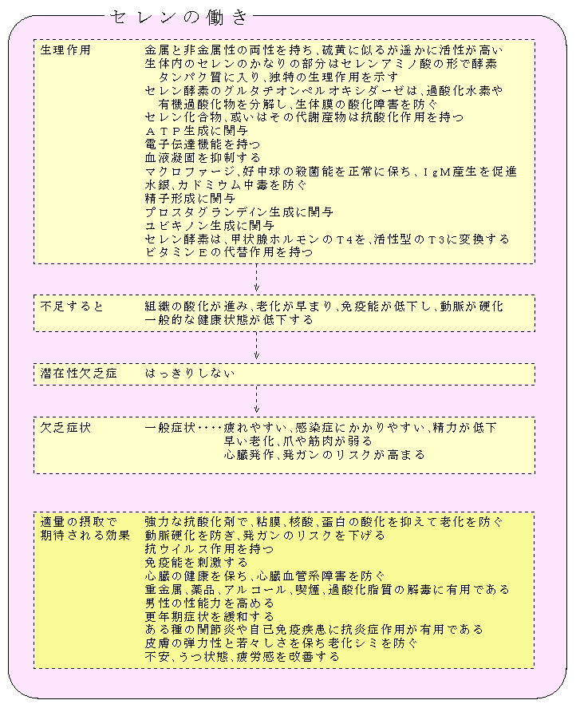
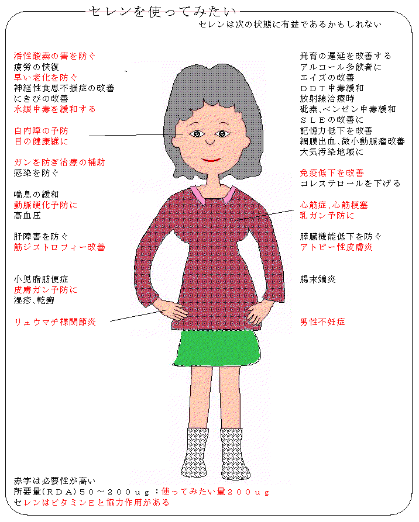

---
categories:
- ミネラル
description: 活性酸素(フリーラジカル)とセレン
slug: selenium-and-freeradical
tags:
- 活性酸素(フリーラジカル)
- セレン
- ミネラル
title: 活性酸素(フリーラジカル)とセレン
---

# 活性酸素(フリーラジカル)とセレン

## セレン

- [セレンはどんな症状で有用か](#serentuk)
- [体内での活性酸素の発生と消去図表](#furiiraz)
- [活性酸素のお話](#katsanso)
- [活性酸素の生成変換の分子図](#kousanka)

## セレンはどんな症状で有効に働くか{#serentuk}

## 活性酸素の発生と消去{#furiiraz}

## 活性酸素のお話{#katsanso}

私たちが呼吸する酸素の1〜3%が活性酸素(フリーラジカル)に転換すると言われます。
最初に生成するのはスーパーオキシドで、これが体内で生成するのは、

- 細胞の中のミトコンドリアでエネルギーを作り出す時
- 白血球の好中球やマクロファージが体内に侵入した細菌などを攻撃する時(殺菌剤として)
- 血流が一時的に途絶え再び流れ始めた時
- 空気中の汚染物質、タバコの煙、アルコールを含むある種の化学薬品、食品添加物、残留農薬の解毒の時
- ストレス時
- 放射線や日光の紫外線を浴びた時

です。

### 活性酸素を除去するシステム: SODとGPX

しかし、体内には、効率的に活性酸素を除去するシステムが備わり、傷害を免れていますが、活性酸素の傷害性レベルが、慢性的に抗酸化剤による防御レベルより高ければ、組織への障害が現れ、結果としてガンが生じることがあります。

活性酸素の除去に関わる酵素は、スーパーオキシドジスムターゼ(SOD)やグルタチオンペルオキシダーゼ(GPX)やカタラーゼですが、これらの活性酸素除去剤(スカベンジャー)はそれぞれ役割があります。

最初に生成するスーパーオキシドを転換するスカベンジャーが、SODという酵素で、絶えず体内で生合成されて、全身の細胞の内外に存在しています。

SODは、スーパーオキシドが発生すると、瞬時に触媒として働いて、過酸化水素に転換させてしまいます。過酸化水素は GPXやカタラーゼ(ミトコンドリアでは)が作用して酸素と水に分解します。

スパーオキシドや過酸化水素が転換されず、たまたま遊離の鉄(銅)イオンが存在すると、反応してヒドロキシラジカルと言う極めて活性(傷害性)の強い活性酸素に変化します。

ヒドロキシラジカルはそばに存在する組織、蛋白質、酵素、細胞膜、遺伝子などと反応して瞬時に消滅しますが、反応によって、遺伝子が障害を受ければ、変異細胞からガン細胞へと移行する可能性があり、細胞や組織の機能が傷害されれば、老化病に移行するリスクが高まります。

スーパーオキシド、過酸化水素或いは鉄イオンを野放しにしておくと、ヒドロキシルラジカルが次々と発生してくるわけです。

ヒドロキシルラジカルの発生を未然に防ぐには、SODとGPXがチームを組んで常に待機している必要があります。

スーパーオキシドはSODが存在しなくても、自身が反応して5秒ほどで過酸化水素に変化するとされています(鉄イオンに会わなければ良い)、そのため過酸化水素を消去するGPXが、結局、活性酸素除去の重要なポイントだと思われます。
GPXはセレンを含んだ蛋白質ですから、セレンが活性酸素除去のキーミネラルと言えるわけです。

セレンとアミノ酸のグルタチオンが体内にたくさんあれば、GPXは次々と生産され、発生した過酸化水素に作用して無害な水と酸素分子に転換していきます。

GPXはさらに大切な働きをしています。
仮にヒドロキシラジカルに細胞膜が酸化されると、連鎖反応を起こして過酸化脂質が溜まり、細胞機能を損ない臓器の障害が誘導されるかもしれません。
ビタミンE、C、CoQなどがこの連鎖反応を止める働きをし、生成した過酸化脂質はGPXが無害な分子に変換するとされます。

## 活性酸素の生成変換の分子図表{#kousanka}

